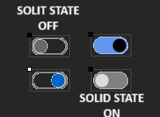

# New.ToggleSwitch Control (.NET Framework 4.8)

`New.ToggleSwitch` é um botão seletor do tipo On/Off personalizável para aplicações **Windows Forms (.NET Framework)**.  
Ideal para substituir `CheckBox` com um visual mais moderno e profissional, baseado no novo layout do Windows.

---

## 🔧 Características

- ✅ Estilo moderno com cantos arredondados
- 🎨 Personalização completa de cores
- 🔁 Alternância suave entre estados ON/OFF
- ⚙️ Comportamento herdado de `CheckBox`
- 🖥️ Fácil de usar no Visual Studio

---

## 📦 Instalação

### Via NuGet

Você pode instalar usando o **Package Manager Console**:

```
Install-Package New.ToggleSwitch
```

Ou pela **.NET CLI**:

```
dotnet add package New.ToggleSwitch
```

---

## 🚀 Como Usar

Adicione o controle programaticamente:

```csharp
using ToggleSwitch;

var toggle = new ToggleSwitch
{
    OnBackColor = Color.MediumSlateBlue,
    OnToggleColor = Color.WhiteSmoke,
    OffBackColor = Color.Gray,
    OffToggleColor = Color.Gainsboro,
    SolidStyle = true,
    Location = new Point(30, 30)
};

this.Add(toggle);
```

---

## 🧪 Exemplo de Evento

```csharp
toggle.CheckedChanged += (s, e) =>
{
    if (toggle.Checked)
        MessageBox.Show("Ligado!");
    else
        MessageBox.Show("Desligado!");
};
```

---

## ⚙️ Propriedades Disponíveis

| Propriedade       | Tipo   | Descrição                                        |
|-------------------|--------|-------------------------------------------------|
| `OnBackColor`     | Color  | Cor de fundo quando o botão está ativado        |
| `OnToggleColor`   | Color  | Cor do botão quando está ativado                |
| `OffBackColor`    | Color  | Cor de fundo quando o botão está desativado     |
| `OffToggleColor`  | Color  | Cor do botão quando está desativado             |
| `SolidStyle`      | bool   | Define se o botão é sólido ou apenas contorno   |

---

## 🖼️ Captura de Tela



---

## 🖥️ Requisitos

- .NET Framework 4.5 ou superior  
- Aplicações Windows Forms

---

## 📃 Licença

Distribuído sob a licença [MIT](https://opensource.org/licenses/MIT).

---

## 🤝 Contribuindo

Contribuições são bem-vindas!  
Sinta-se à vontade para abrir issues ou enviar pull requests.

---

## 🙋‍♂️ Autor

Criado por [@sandrolsa](https://github.com/sandrolsa) 
Dúvidas ou sugestões: [sandrolsa@gmail.com](mailto:sandrolsa.sdr@gmail.com)
Projeto para uso pessoal, use e adapte como quiser.